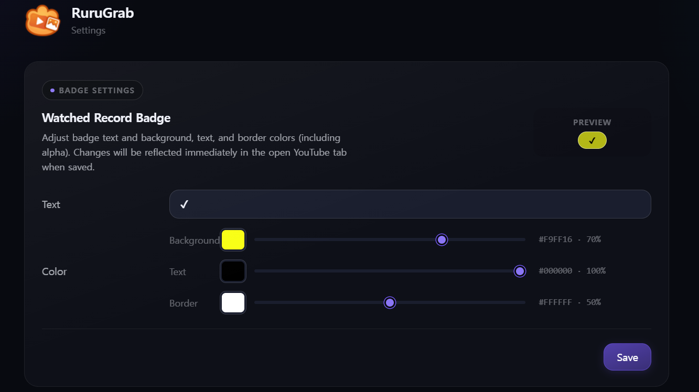
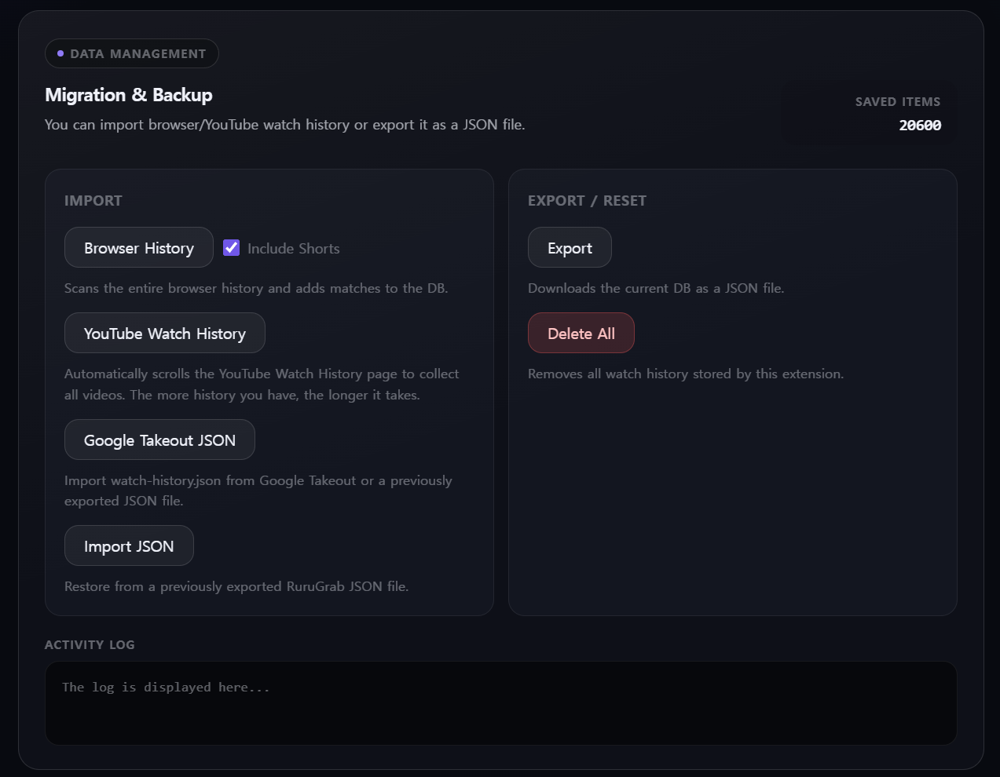
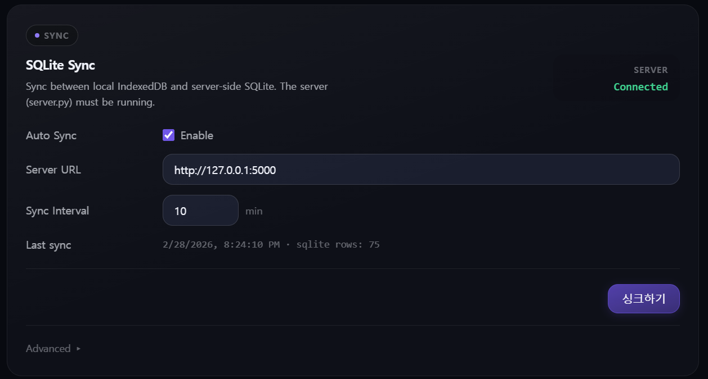
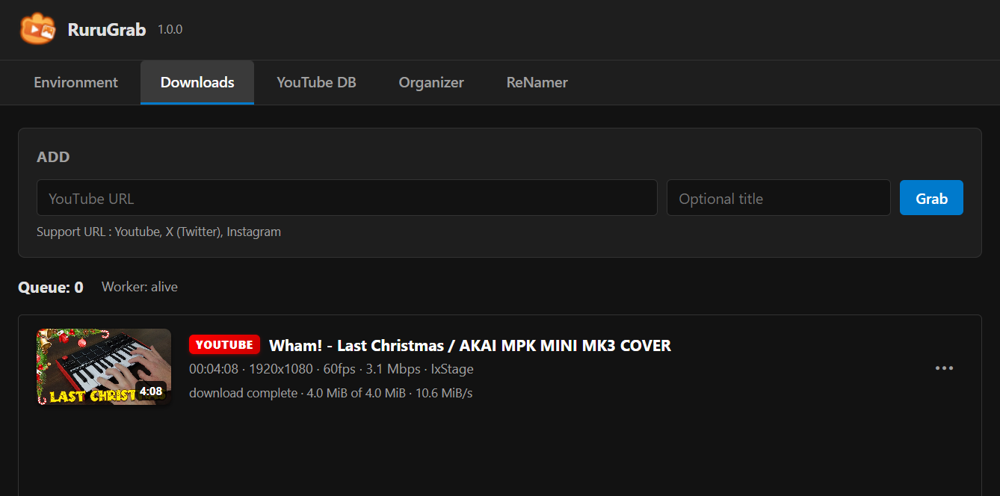
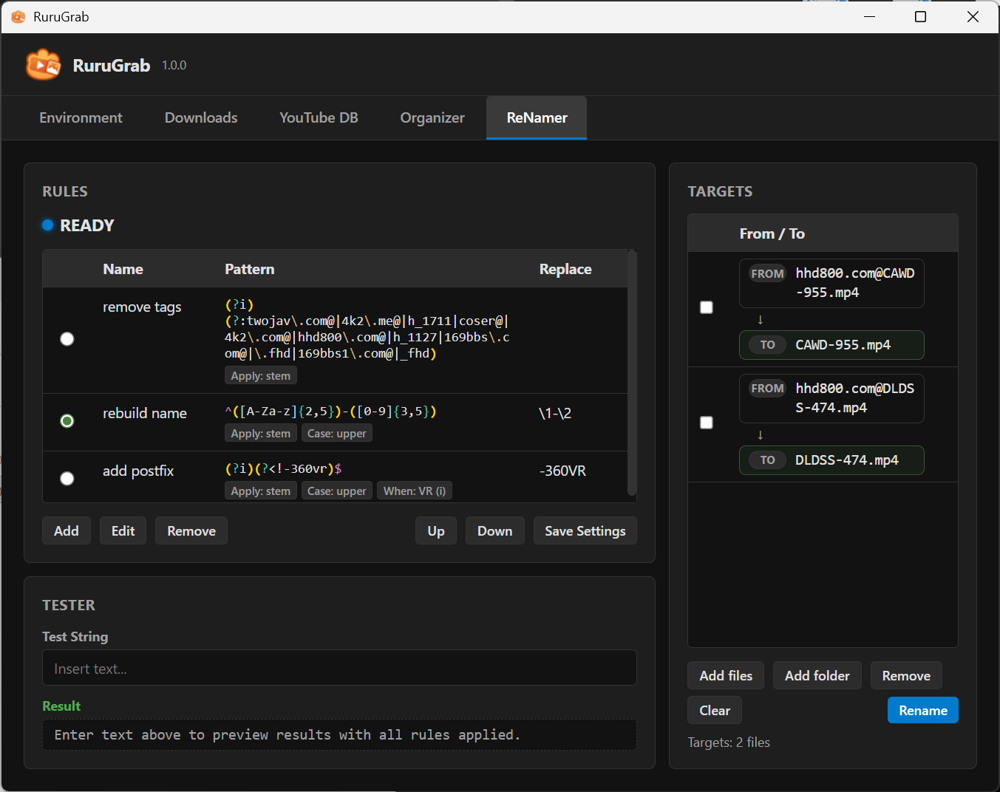
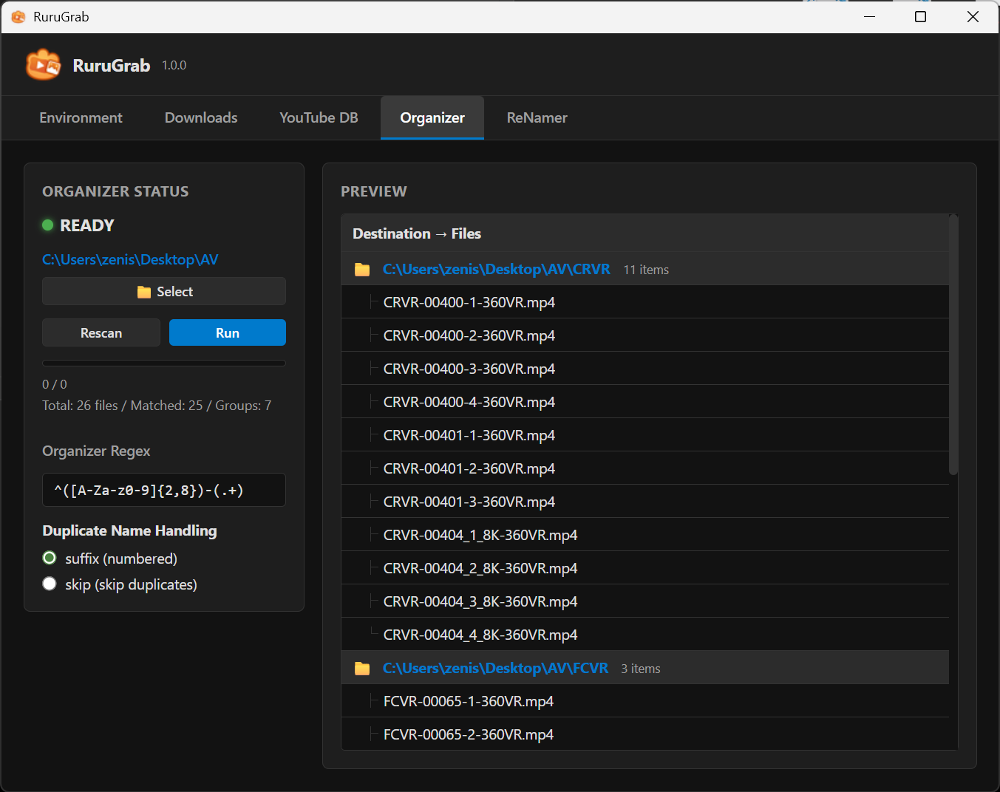

    
> **AI Disclosure**
> Part or all of the code used in this project was generated by AI.

# RuruGrab

RuruGrab is a **Chrome / Edge** solution that combines a **browser extension** and a **local core app** to:

- Download media from **YouTube / X (Twitter) / Instagram**
- Track YouTube watch history and show **visual watch marks** on thumbnails
- Batch rename files with **rule-based filename transforms**
- Batch move files into folders based on **filename rules**
- Optionally sync watch history across browsers via a **local/SQLite sync** workflow

## Screenshots
### Extension
#### YouTube WATCHED Mark


#### Options - Badge Settings


#### Options - Migration & Backup


#### Options - SQLite Sync (Deskop application)


### App
#### Downloader Tab


#### Renamer Tab


#### Organizer Tab


> **Repo layout**
> - `extension/` — Browser Extension (Manifest V3)
> - `app/` — Core App (Tauri v2 + Vite)

## Features

### Media Downloader
- Download **images and videos** from:
  - YouTube
  - X (formerly Twitter)
  - Instagram
- Trigger downloads via extension actions and site-specific integrations.

### Rule-Based File Organizer
- Batch rename files using **rule-based filename transforms**.
- Batch move files into folders based on **filename rules**.
- Useful for post-download cleanup, naming normalization, and library organization.

### Smart YouTube History & Watch Marks
- Tracks YouTube viewing activity locally.
- Displays a **WATCHED** badge/mark on thumbnails so you can quickly see what you’ve already watched.
- Badge text/colors are configurable from the Options page.

### Optional Sync (SQLite)
- Sync between **Extension** () and a **Core App**.
- The extension expects a sync server reachable at `http://127.0.0.1:5000` (default).

## Architecture

### 1) Browser Extension (`extension/`)
- **Manifest V3** (`manifest_version: 3`)
- **Service worker** background: `background.js`
- **Content scripts** for:
  - YouTube
  - X (Twitter)
  - Instagram
- Options page: `options.html`
  - Badge customization
  - Import/export/reset watch DB
  - SQLite sync configuration (server URL, interval, manual sync/restore)

> Extension name: **RuruGrab** (current version in manifest: **2.2.5**)

### 2) Core App (`app/`) — Tauri v2 + Vite
- Frontend: **Vite**
- Desktop wrapper: **Tauri v2**
- External tools (configured as `externalBin` in Tauri):
  - `yt-dlp`
  - `ffmpeg`
  - `ffprobe`
  - `gallery-dl`

> These binaries are expected under `app/binaries/` (platform-specific executables).
> ffmpeg-x86_64-pc-windows-msvc.exe
> ffplay-x86_64-pc-windows-msvc.exe
> ffprobe-x86_64-pc-windows-msvc.exe
> gallery-dl-x86_64-pc-windows-msvc.exe
> yt-dlp-x86_64-pc-windows-msvc.exe


## Quick Start (Development)

### Prerequisites
- Node.js (LTS recommended)
- Rust toolchain + Tauri prerequisites for your OS

### A) Run the Core App (Tauri)
```bash
cd app
npm install
npm run tauri dev
```

Build (no bundle):
```bash
cd app
npm install
npm run build:exe
```

### B) Load the Extension (Chrome / Edge)
1. Open **Extensions**
2. Enable **Developer mode**
3. Click **Load unpacked**
4. Select the `extension/` folder

### C) Configure (Options)
Open the extension Options page:
- **Badge Settings** → adjust WATCHED badge text/colors
- **Migration & Backup** → import/export/reset local DB
- **SQLite Sync** → set server URL, interval, and run sync/restore

## File Organization Workflow

A typical workflow in RuruGrab is:
1. Download media from supported sites
2. Apply **rule-based batch renaming** to normalize filenames
3. Apply **rule-based folder moves** to sort files into matching directories

This makes it easier to keep downloaded media organized without manual file-by-file cleanup.


## Configuration Notes

### Localhost Connectivity
The extension and core app are configured to communicate with localhost endpoints (default includes `127.0.0.1:5000`).

### Data Storage & Privacy
- By default, watch history is stored **locally** in the extension’s storage (IndexedDB).
- If you enable **SQLite Sync**, watch history will be sent to the server you configure.


## Repository Layout

```
.
├─ extension/   # Browser extension (MV3)
└─ app/         # Tauri v2 desktop core app (Vite + Rust)
```

## License
MIT License.

